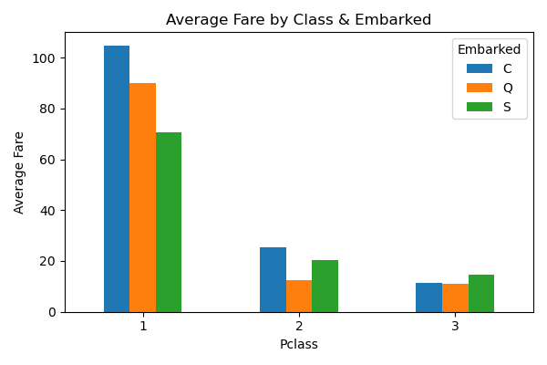

# Task One - Data Science Internship at Growfinix

## 📌 Overview
This task is part of my Data Science internship at **Growfinix**.  
The goal was to analyze the Titanic dataset, perform data cleaning, and create both static and interactive visualizations.

---

## 📂 Files in This Task
- `Taitanic_Analysis.ipynb` → Jupyter Notebook with all steps of analysis.
- `titanic_cleaned.xls` → Cleaned dataset after preprocessing.
- `survival_by_class.png` → Static chart showing survival rates by passenger class.
- `fare_by_class_embarked.png` → Static chart showing fare distribution by class and embarkation point.
- Interactive Plotly visualizations inside the Jupyter Notebook.

---

## 🔍 Steps Performed
1. **Data Cleaning**  
   - Removed missing values.
   - Converted data types where necessary.
   - Handled outliers.
   
2. **Exploratory Data Analysis (EDA)**  
   - Checked survival distribution across different passenger classes.
   - Analyzed fare distribution by class and embarkation port.
   
3. **Visualization**  
   - Created **Matplotlib/Seaborn static plots**.
   - Developed **interactive Plotly charts** for deeper insights.

---

## 📊 Sample Outputs
**Survival by Class**  

**Fare by Class & Embarked**  

---

## 🛠️ Tools & Libraries Used
- Python (Pandas, NumPy)
- Matplotlib & Seaborn
- Plotly (Interactive Plots)
- Jupyter Notebook

---

## 🏆 Outcome
This task provided insights into passenger demographics and survival patterns on the Titanic, using both static and interactive visualizations for better storytelling.
